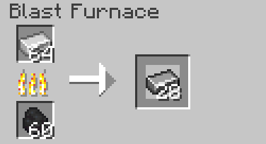
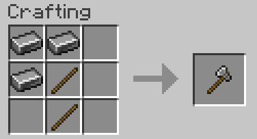
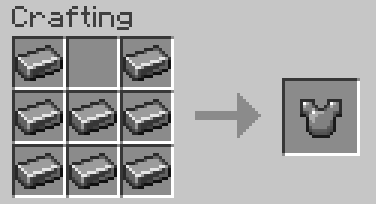
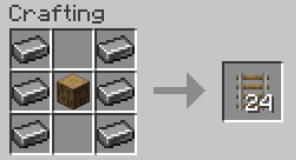

# SteelCrafting

[LICENSE](LICENSE.md)

**SteelCrafting** is a Fabric mod that adds steel tools and armor, crafted from steel ingots obtained by blasting iron ingots.

## Items

### Steel Ingot

Steel ingots are the base material for all steel tools and armor.
Obtain by blasting iron ingots in a blast furnace for a long time. 

## Tools

**Steel tools** are as strong and **as fast as iron tools** but have the **durability of diamond.**

- **Steel Sword**  
- **Steel Pickaxe**  
- **Steel Axe**  
- **Steel Shovel**  
- **Steel Hoe**  
- **Steel Shears**

## Armor

**Steel armor** offers the same **protection as iron armor** but has the **durability of diamond.**

- **Steel Helmet**  
- **Steel Chestplate**  
- **Steel Leggings**  
- **Steel Boots**  

## Other Recipes

- **Bucket Crafting**  
  Craft two **buckets** using three **steel ingots** in the same pattern as the vanilla bucket recipe.  

- **Improved Flint and Steel**  
  Craft a **Flint and Steel** using **flint** and a **steel ingot** (flint above steel ingot).  
  This tool works like the vanilla flint and steel, but has **4x the durability (256 uses)**.
  
- **Rail Crafting**  
  Craft **24 rails** using **steel ingots** and **logs**.
  The vanilla recipe using sticks and iron creates 16 rails.

- **Steel Shears**  
  Craft **Steel Shears** using two **steel ingots** in the same pattern as vanilla shears.  
  These shears have **double the durability** and shear blocks/entities **faster** than vanilla shears.

## Installation

The compiled mod JAR can be found in the `build/libs/` directory of this repository after running the build task.

1. Download the mod version you need for your minecraft version.
2. Ensure you have the matching verison of the fabric installed and have a profile for it.
3. Place the JAR into the `mods` folder of your Minecraft instance.  
4. Launch Minecraft with the Fabric profile. 